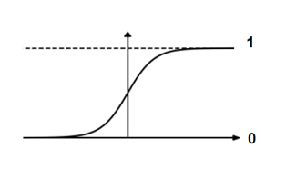
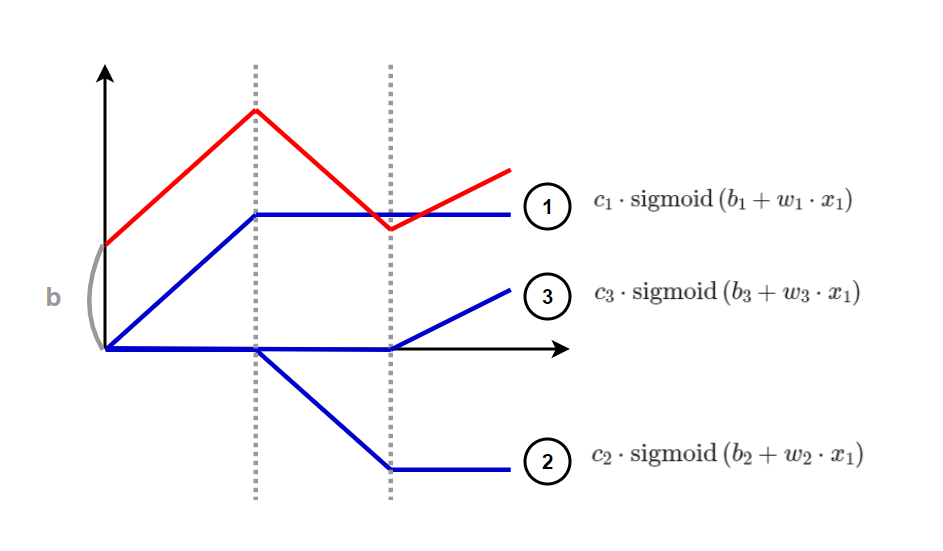
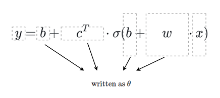
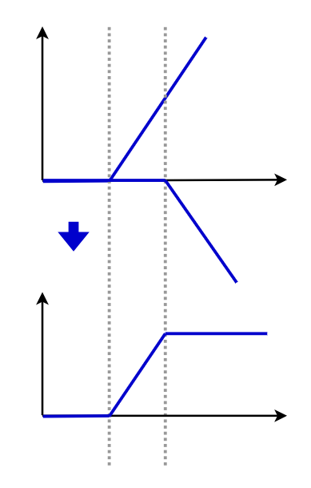
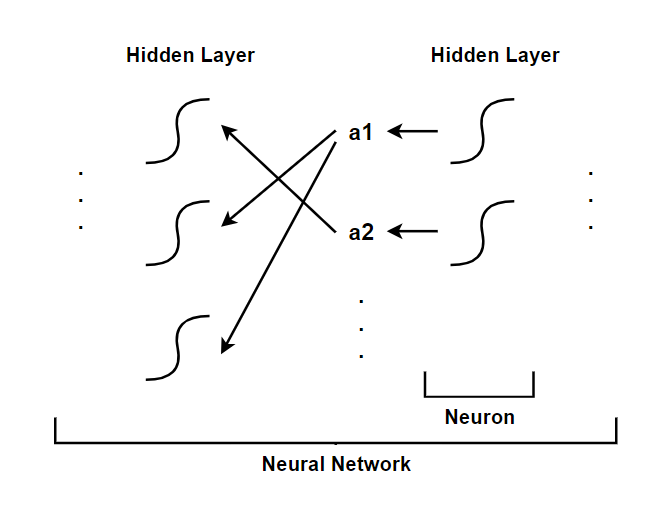

# Lecture 1 Introduction of Deep Learning Class

Full course Syllabus reference to [Machine Learing 2022 Spring](https://speech.ee.ntu.edu.tw/~hylee/ml/2022-spring.php?fbclid=IwAR2rE3UFymIOeTEoEzyZBhO-5vbpYpyw1Ho_KHO8cmwVd0_f7nI3iYunW4A)  
Note for lecture(Hung-yi Lee YouTube)  
(1) [【機器學習2021】預測本頻道觀看人數 (上) - 機器學習基本概念簡介](https://www.youtube.com/watch?v=Ye018rCVvOo)  
(2) [【機器學習2021】預測本頻道觀看人數 (下) - 深度學習基本概念簡介](https://www.youtube.com/watch?v=bHcJCp2Fyxs)  
(3) [【機器學習2022】開學囉~ 又要週更了~](https://www.youtube.com/watch?v=7XZR0-4uS5s)  

## Sigmoid Function

  

The sigmoid function is:  

$$
S(t) = \frac{1}{1 + e^{-t}}
$$

The equation for the output \( y \) is:

$$
y = c\cdot\frac{1}{1 + e^{-(b+w \cdot x_1)}}
= c\cdot \text{sigmoid}(b+w \cdot x_1)
$$

where:
- \( w \): slopes
- \( b \): shift
- \( c \): height
- \( x \): feature

## Hard Sigmoid

### Combining Hard Sigmoid

The formula for the combining hard sigmoid is:

$$
y = b + \sum_{i} c_i \cdot \text{sigmoid}\left(b_i + w_i \cdot x_1\right)
$$

where \(x_1\) varies.

For different \(x_j\), we have:

$$
r = b + \sum_{j} \left(w_j \cdot x_j\right), \quad a = \text{sigmoid}(r) = \frac{1}{1 + e^{-r}}
$$

Therefore,

$$
y = b + \sum_{i} c_i \cdot \text{sigmoid}\left(b_i + \sum_{j} \left(w_{ij} \cdot x_j\right)\right)
$$

  

Here's a polished and organized version of your notes:

### Define Loss Function

The loss function \( L \) is defined as the average of all errors:

$$
L = \frac{1}{N} \cdot \sum_{n} e_n
$$

where \( N \) is the number of observations and \( e_n \) is the error for the n-th observation.

### Finding the Optimal \(θ\)

To find the parameter \(θ\) that minimizes the loss function \(L\), we solve:

$$
\theta^* = \text{arg} \underset{\theta}{\text{min}} \, L
$$

where \(θ^*\) is the value of theta that minimizes \(L\).

**Training:**

$$
y = f_{\theta}(x)
$$

Define \(L(θ)\), find \( θ^* \)
$$
\Rightarrow y = f_{\theta^*}(x) \quad \text{to label testing data}
$$

### Gradient Computation

To optimize the loss function, compute the gradient of \(L\) with respect to \(θ\) at the initial guess \(θ^0\):

$$
g = \nabla L(\theta^0) = \begin{bmatrix}
\frac{\partial L}{\partial \theta_1} \bigg|_{\theta = \theta^0} \\
\vdots \\
\vdots \\
\end{bmatrix}
$$

$$
\begin{bmatrix}
\theta_1^1 \\
\theta_2^1 \\
\vdots \\
\end{bmatrix}
\leftarrow
\begin{bmatrix}
\theta_0^1 \\
\theta_0^1 \\
\vdots \\
\end{bmatrix} - 
\begin{bmatrix}
\eta \frac{\partial L}{\partial \theta_1} \bigg|_{\theta = \theta^0} \\
\eta \frac{\partial L}{\partial \theta_2} \bigg|_{\theta = \theta^0} \\
\vdots \\
\end{bmatrix}
$$

$$
\theta^1 \leftarrow \theta^0 - \eta g \quad \text{(update)}
$$

In fact, the batches have been randomly divided, and batch 1 is used to calculate L^1 to obtain θ^1, batch 2 is used to calculate L^2 to obtain θ^2...  
1 epoch = see all the batches once.  

### Rectified Linear Unit(ReLU)
$$
f(x) = max(0, x)
$$
$$
\Rightarrow cmax(0, b + w \cdot x_1)
$$

2ReLU ⇒ Hard Sigmoid

  

$$
y = b + \sum_{i} c_i \cdot \text{sigmoid}\left(b_i + \sum_{j} \left(w_{ij} \cdot x_j\right)\right)
$$
$$
\Rightarrow 
y = b + \sum_{2i} c_i \cdot max\left(0, b_i + \sum_{j} \left(w_{ij} \cdot x_j\right)\right)
$$

Generally called those as Activation Function  

### Neural Network
layers ⇒ deep → deep learning    

deeper  
(1) training data ✔  
(2) unseen data ✗ ⇒ overfitting  