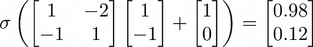
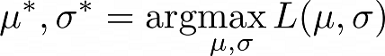
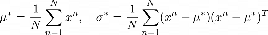
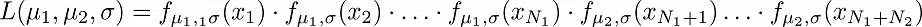
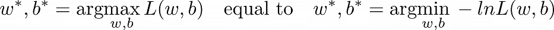

# Lecture 1 Introduction of Deep Learning Extra

Full course Syllabus reference to [Machine Learing 2022 Spring](https://speech.ee.ntu.edu.tw/~hylee/ml/2022-spring.php?fbclid=IwAR2rE3UFymIOeTEoEzyZBhO-5vbpYpyw1Ho_KHO8cmwVd0_f7nI3iYunW4A)  
Note for lecture(Hung-yi Lee YouTube)  
(1) [ML Lecture 6: Brief Introduction of Deep Learning](https://www.youtube.com/watch?v=Dr-WRlEFefw)  
(2) [ML Lecture 7: Backpropagation](https://www.youtube.com/watch?v=ibJpTrp5mcE)  
(3)  [ML Lecture 1: Regression - Case Study](https://www.youtube.com/watch?v=fegAeph9UaA)  
(4) [ML Lecture 4: Classification](https://www.youtube.com/watch?v=fZAZUYEeIMg)  
(5) [ML Lecture 5: Logistic Regression](https://www.youtube.com/watch?v=hSXFuypLukA)  

## Deep Learning

(1) Define a set of function  
(2) Goodness of function  
(3) Pick the best function  

### Fully Connected Feedforward

Layer 1: input layer  
Layer 2: hidden layer  
...  
Layer N-1: hidden layer (feature extractor replacing feature engineering)  
Layer N: output layer  

  

Write the calculation as a matrix:  

  

<!-- $$
\sigma \left(
\begin{bmatrix}
1 & -2 \\
-1 & 1
\end{bmatrix}
\begin{bmatrix}
1 \\
-1
\end{bmatrix}
+
\begin{bmatrix}
1 \\
0
\end{bmatrix}
\right)
=
\begin{bmatrix}
0.98 \\
0.12
\end{bmatrix}
$$ -->

Example: Handwriting Digit Recognition  
Input 16*16: 256 dim, output 0~9: 10 dim  

### Cross Entropy

$$
C \Rightarrow \mathcal{L} = \sum C^n \quad \text{gradient descent}
$$

#### Universal Approximation Theorem
Any continuous f

$$
f: \mathcal{R}^N \rightarrow \mathcal{R}^M
$$

can by realized by a network with one hidden layer(with enough hidden neurons)  

## Backpropagation

$$
\mathcal{L}(\theta) = \sum_{n=1}^{N} C^n(\theta)
$$

$$
\frac{\partial}{\partial w} \mathcal{L}(\theta) = \sum_{n=1}^{N} \frac{\partial C^n(\theta)}{\partial w}
$$

  

The derivative of the cost \( c \) with respect to weight \( w \):

$$
\frac{\partial c}{\partial w} = \frac{\partial z}{\partial w} \cdot \frac{\partial c}{\partial z}
$$

**Forward pass**

$$
z = x_1w_1 + x_2w_2 + b
$$

Partial derivatives:

$$
\frac{\partial z}{\partial w_1} = x_1, \quad \frac{\partial z}{\partial w_2} = x_2
$$

**Backward pass**

$$
\frac{\partial c}{\partial z} = \frac{\partial a}{\partial z} \cdot \frac{\partial c}{\partial a}
$$

$$
\text{where} \quad \frac{\partial a}{\partial z} \quad \text{ is the sigmoid derivative.}
$$

Gradient of \( c \) with respect to \( a \):

$$
\frac{\partial c}{\partial a} = \frac{\partial z'}{\partial a} \cdot \frac{\partial c}{\partial z'} + \frac{\partial z''}{\partial a} \cdot \frac{\partial c}{\partial z''}
$$

Given:

$$
\frac{\partial z'}{\partial a} = w_3, \quad \frac{\partial z''}{\partial a} = w_4
$$

Final expression:

$$
\frac{\partial c}{\partial z} = \sigma'(z) \cdot \left[w_3 \cdot \frac{\partial c}{\partial z'} + w_4 \cdot \frac{\partial c}{\partial z''}\right]
$$

$$
\text{where} \quad  \sigma'(z) \quad  \text{ is constant.}
$$

**Case 1. Output Layer**  

$$
 \frac{\partial c}{\partial z'} =  \frac{\partial y_1}{\partial z'} \cdot \frac{\partial c}{\partial y_1}
$$

$$
 \frac{\partial c}{\partial z''} =  \frac{\partial y_2}{\partial z''} \cdot \frac{\partial c}{\partial y_2}
$$

**Case 2. Not Output Layer**  
Continue to the next layer until reaching the Output Layer.  

## Regularization

If we hope function is smooth, smaller wi is better  

$$
y = b + \sum w_i x_i
$$

so define loss function as:  

$$
L = \sum_n \left(\hat{y}^n - \left( b + \sum w_i x_i \right)\right)^2 + \lambda \sum (w_i)^2
$$

## Classifier

  

Given

$$
P(x) =P(x \mid C_1) \cdot P(C_1) + P(x \mid C_2) \cdot P(C_2)
$$

Bayes' theorem:  

$$
P(C_1 \mid x) = \frac{P(x \mid C_1) \cdot P(C_1)}{P(x \mid C_1) \cdot P(C_1) + P(x \mid C_2) \cdot P(C_2)}
$$

If x not in C1 of training data but x definitly in Class 1, use C1 to find its Gaussian Distribution.  

$$
L(\mu, \sigma) = f_{\mu, \sigma}(x_1) \cdot f_{\mu, \sigma}(x_2) \cdot \ldots \cdot f_{\mu, \sigma}(x_N)
$$

Find the parameters 𝜇∗ and 𝜎∗ that maximize the likelihood:  

<!-- $$
\mu^*, \sigma^* = \text{arg} \underset{\mu, \sigma}{\text{max}} \, L(\mu, \sigma)
$$ -->

  

where  

<!-- $$
\mu^*= \frac{1}{N} \sum_{n=1}^{N} x_n, \quad 
\sigma^* = \frac{1}{N} \sum_{n=1}^{N} (x_n - \mu^*)(x_n - \mu^*)^T
$$ -->

  

After substituting the values, we obtain the probability of 
x, if P(C1|x) > 0.5, x belong of class 1.  

### Modifying Model

Given class 1, class 2, same σ, less parameter.  

<!-- $$
L(\mu_1, \mu_2, \sigma) = f_{\mu_1,_1 \sigma}(x_1) \cdot f_{\mu_1, \sigma}(x_2) \cdot \ldots \cdot f_{\mu_1, \sigma}(x_{N_1}) \cdot f_{\mu_2, \sigma}(x_{N_1+1}) \ldots \cdot f_{\mu_2, \sigma}(x_{N_1+N_2}) 
$$ -->

  

Class 1: Ranges from 1 to N1  
Class 2: Ranges from N1+1 to N1+N2  

Functions for μ1 and μ2 are the same as above.  

$$
\sigma^* = \frac{N_1}{N_1 + N_2} \sigma^1 + \frac{N_2}{N_1 + N_2} \sigma^2
$$

If all dims independent, we can use Naive Bayes Classifier:  

$$
P(x \mid C_1) =P(x_1 \mid C_1) \cdot P(x_2 \mid C_1) \ldots \cdot P(x_k \mid C_1) 
$$

### Posterior Probability

$$
P(C_1 \mid x) = \frac{P(x \mid C_1) \cdot P(C_1)}{P(x \mid C_1) \cdot P(C_1) + P(x \mid C_2) \cdot P(C_2)}
$$

$$
= \frac{1}{1 + \frac{P(x \mid C_2) \cdot P(C_2)}{P(x \mid C_1) \cdot P(C_1)}}
$$

let 

$$
z = \ln \frac{P(x \mid C_1) \cdot P(C_1)}{P(x \mid C_2) \cdot P(C_2)}
$$

so 

$$
= \frac{1}{1 + \exp(-z)} = \sigma(z)
$$

calculate z:  

$$
z = \ln \frac{P(x \mid C_1) \cdot P(C_1)}{P(x \mid C_2) \cdot P(C_2)} 
$$

$$
 = \ln \frac{P(x \mid C_1)}{P(x \mid C_2)} + \ln \frac{P(C_1)}{P(C_2)}
$$

and 

$$
\frac{P(C_1)}{P(C_2)} = \frac{\frac{N_1}{N_1 + N_2}}{\frac{N_2}{N_1 + N_2}} = \frac{N_1}{N_2}
$$

By Gaussian Distribution  

$$
P(x|C_1) = \frac{1}{(2\pi)^{D/2}} \cdot \frac{1}{|\sigma_1|^{1/2}} \cdot \exp \left( -\frac{1}{2} (x - \mu_1)^T (\sigma_1)^{-1} (x - \mu_1)\right)
$$

and 

$$
P(x|C_2) = \frac{1}{(2\pi)^{D/2}} \cdot \frac{1}{|\sigma_2|^{1/2}} \exp\left (-\frac{1}{2} (x - \mu_2)^T (\sigma_2)^{-2} (x - \mu_2)\right)
$$

$$
\frac{P(x|C_1)}{P(x|C_2)} = \ln \frac{|\sigma_1|^{1/2}}{|\sigma_2|^{1/2}} \cdot  \exp\left (-\frac{1}{2} [(x - \mu_1)^T (\sigma_1)^{-1} (x - \mu_1) - (x - \mu_2)^T (\sigma_2)^{-2} (x - \mu_2) ]\right )
$$

$$
= (\mu_1 - \mu_2)^T \sigma^{-1} x - \frac{1}{2} (\mu_1)^T \sigma^{-1} \mu_1 + \frac{1}{2} (\mu_2)^T \sigma^{-1} \mu_2 + \ln \frac{N_1}{N_2}
$$

by let σ1 = σ2 = σ

$$
P(x|C_1) = \sigma(w \cdot x + b)
$$

where 

$$
w = (\mu_1 - \mu_2)^T \sigma^{-1}, b = - \frac{1}{2} (\mu_1)^T \sigma^{-1} \mu_1 + \frac{1}{2} (\mu_2)^T \sigma^{-1} \mu_2 + \ln \frac{N_1}{N_2}
$$

called Logistic Regression  

### Logistic Regression

#### Step 1. function set  
#### Step 2. Goodness of function

$$
\begin{array}{cc}
\text{Training Data} & \text{Class} \\
x_1 & C_1 \\
x_2 & C_1 \\
x_3 & C_2 \\
\vdots & \vdots \\
x_N & C_1
\end{array}
$$

This table illustrates that the data points belong to either class C1​ or class C2.  

$$
f_{w,b}(x) = P_{w,b}(C_1|x)
$$

$$
L_{w,b}(x) = f_{w,b}(x_1) \cdot f_{w,b}(x_2) \cdot (1 - f_{w,b}(x_3)) \cdots f_{w,b}(x_N)
$$

we have  

<!-- $$
w^*, b^* = \text{arg} \underset{w, b}{\text{max}} \, L(w, b) \quad \text{equal to} \quad w^*, b^* = \text{arg} \underset{w, b}{\text{min}} \, -lnL(w, b)
$$ -->

  

since

$$
-lnL(w, b) = -lnf_{w,b}(x_1) -lnf_{w,b}(x_2) -ln(1 - f_{w,b}(x_3)) - \cdots
$$

we write

$$
\hat{y} = 
\begin{cases} 
1 & \text{if class 1} \\ 
0 & \text{if class 2} 
\end{cases}
$$

#### Step 3. Find the best function  

$$
\frac{\partial-lnL}{\partial w_i} = \sum_{n}-[\hat{y}\frac{\partial lnf_{w,b}(x^n)}{\partial w_i} + (1 - \hat{y})\frac{\partial ln(1-f_{w,b}(x^n))}{\partial w_i}]
$$