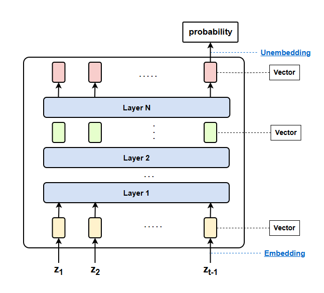
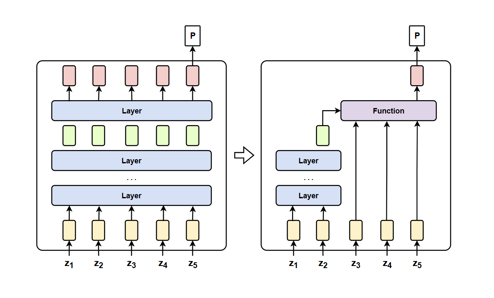

# Lecture 3 Analyzing the Neural Network Architecture Behind Transformer

Full course syllabus reference to [Machine Learning 2025](https://course.ntu.edu.tw/courses/113-2/41735)  
Note for lecture （Hung-yi Lee YouTube）  
(1) [【生成式AI時代下的機器學習(2025)】第三講：AI 的腦科學 — 語言模型內部運作機制剖析 (解析單一神經元到整群神經元的運作機制、如何讓語言模型說出自己的內心世界)](https://www.youtube.com/watch?v=Xnil63UDW2o&list=PLJV_el3uVTsNZEFAdQsDeOdzAaHTca2Gi&index=3)


## Transformer




### Single Neuron

Within a Transformer layer, there are sub-layers:
- Self-attention layer  
- Feed-forward layer (applies independently to each token)

Single neuron performs:  
```
Vector → Weighted Sum → Activation Function → Output Vector
```

#### Analyze what a neuron does:
- Observe what happens when the neuron is activated  
- Remove the neuron and see what effect disappears  
   - How to remove it: set its value to 0 or to an average  
- Activate the neuron at different levels and observe changes


#### Conclusion
- Modifying a single neuron usually does not change the overall model output, only shifts some probabilities  
- A task is typically managed by multiple neurons
  - Tasks are likely handled by combinations of neurons. With 4096 neurons, there are up to 2⁴⁰⁹⁶ possible combinations.
  
- A single neuron often participates in multiple tasks  


### Layer of Neurons

**Function Vector**: A vector representing a specific semantic or functional feature.

The output of a layer is called a **representation**.  
If the representation is close to a function vector, the function may be triggered.

```
Representation ≈ Function Vector + Other Function Vectors
```


#### Estimate a function vector

Observe cases where the function is triggered = `function vector` + `other function vectors`

Observe cases where the function is not triggered = `other function vectors'`

Assume average of `other function vectors` and average of `other function vectors'` are similar, so they cancel out.

Then:  

```
Function Vector ≈ (Average of activated representations) − (Average of non-activated representations)
```

Inject the derived `function vector` into the network and check if the intended function is activated.  


We can assume that each observed representation is a linear combination of **functional vectors**:

$$
\begin{aligned}
h_1 &= \alpha_{11} v_1 + \alpha_{12} v_2 + \alpha_{13} v_3 + \cdots + \alpha_{1K} v_K + e_1 \\
h_2 &= \alpha_{21} v_1 + \alpha_{22} v_2 + \alpha_{23} v_3 + \cdots + \alpha_{2K} v_K + e_2 \\
&\vdots \\
h_N &= \alpha_{N1} v_1 + \alpha_{N2} v_2 + \alpha_{N3} v_3 + \cdots + \alpha_{NK} v_K + e_N
\end{aligned}
$$

We can make some assumptions:  
The error terms $e_1, e_2, \ldots, e_N$ should be as small as possible.

So we minimize the reconstruction loss:

$$
L = \sum_{n=1}^{N} |e_n|^2
$$

However, minimizing this alone can lead to trivial solutions (e.g., one-hot vectors).  
Thus, we need additional assumptions — for example, we prefer to use as few functional vectors as possible each time, meaning that the coefficients $\alpha$ should be mostly zero.

We add a sparsity penalty:

$$
L = \sum_{n=1}^{N} |e_n|^2 + \lambda \sum_{n=1}^{N} \sum_{k=1}^{K} |\alpha_{nk}|
$$

Then we minimize this new objective.

This can be solved using a **Sparse Auto-Encoder (SAE)**.


### Group of Neurons

